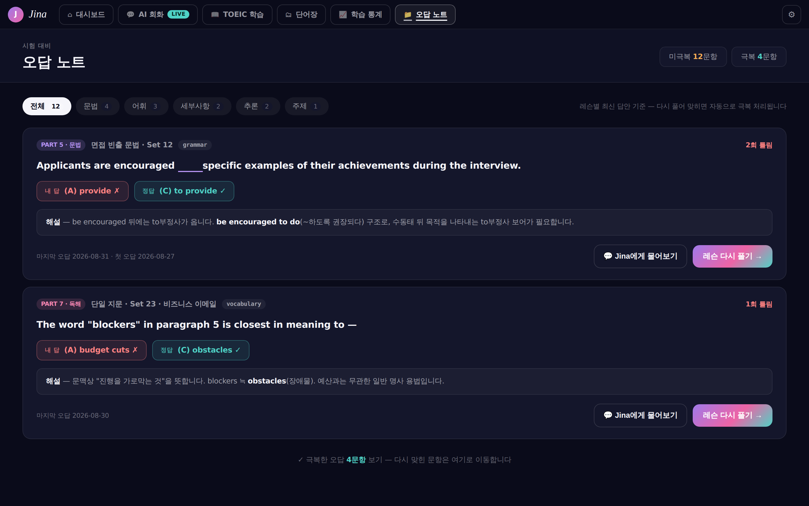
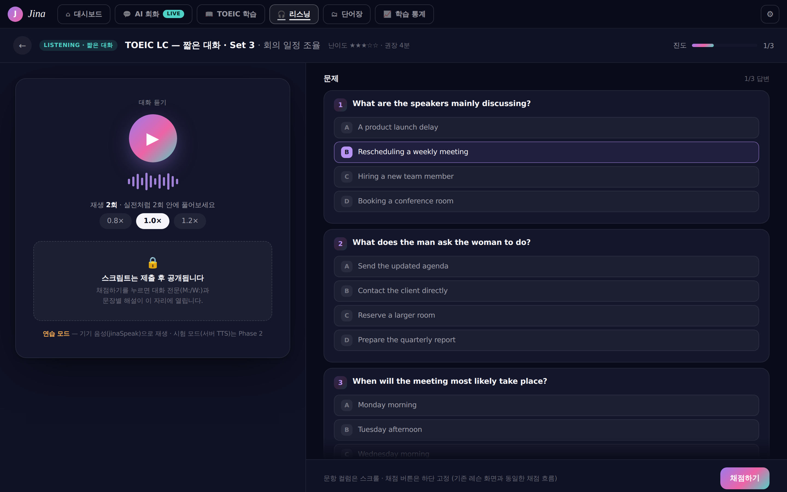
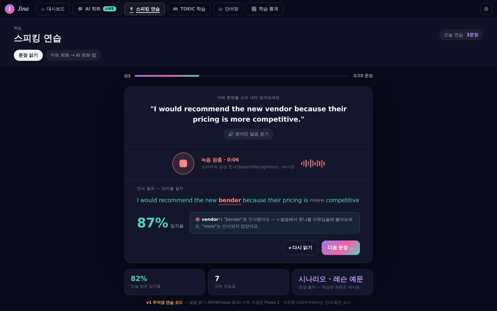

# 08 — 오답 노트 · 리스닝(LC) · 스피킹 플랜 (2026-08-31)

사이드바 '준비 중' 3항목(`app-nav.jsx`의 `mistakes`/`listening`/`speaking`)을 실기능으로 전환하는 플랜.
플랜 07이 미룬 항목("타이머·오답 노트 테이블, LC/TTS 문항")의 후속이며, 07의 합의(파생값 우선·정답 비노출·draft 검증)를 계승한다.

## 0. 화면 자산 검토 → 목업 제작 (2026-09-01 갱신)

착수 시점의 검토 결과는 "신규 화면 디자인 이미지 없음"이었다:

| 자산 | 검토 결과 |
|---|---|
| 저장소 이미지 파일 | `ss-real-*.png`·`ss-lesson-*.png`(루트, 미추적) — **기존 화면의 검증 스크린샷**일 뿐, 신규 화면 목업 아님 |
| 캔버스 아트보드 | 10개(회화·학습·대시보드·단어장·통계 × 데스크탑/모바일) — 세 화면 해당 없음 |
| `docs/HANDOFF.md` §7 | 이미지가 아닌 **규격 텍스트**: MediaRecorder 캡처 패턴, 발음 단어별 점수 색상 매핑(`≥85 success / ≥65 warning / 미만 error`) — 스피킹 UI에 그대로 채용 |
| 기존 화면 내 음성 데모 | 없음(모바일 대시보드 히어로의 Mic 아이콘 1개뿐) |

→ 그래서 **구현 전에 세 화면의 디자인 미리보기를 먼저 만들었다.** 아래 이미지가 시각 기준이고,
본문의 ASCII 와이어프레임은 구조 요약으로 남긴다.

| 화면 | 미리보기 | 목업 소스 |
|---|---|---|
| 오답 노트 (Phase A) | [`img/08-mistakes.png`](img/08-mistakes.png) | [`mockups/08-mistakes.html`](mockups/08-mistakes.html) |
| 리스닝 LC (Phase B) | [`img/08-listening.png`](img/08-listening.png) | [`mockups/08-listening.html`](mockups/08-listening.html) |
| 스피킹 연습 (Phase C) | [`img/08-speaking.png`](img/08-speaking.png) | [`mockups/08-speaking.html`](mockups/08-speaking.html) |

### 오답 노트


### 리스닝 (LC 연습)


### 스피킹 연습


**목업 규칙 — 구현자가 지켜야 할 것**
- 목업은 `src/shared/tokens.jsx` 의 **aurora(Midnight Aurora) 토큰 사본**(`mockups/shared.css`)으로 그렸다. 구현은 CSS 사본이 아니라 **`theme.*` 인라인 스타일**을 쓴다 — 4개 테마 전환이 깨지면 안 된다.
- 색 대응: 카드 `theme.surface`+`theme.border`/15~20px 라운드, 필터 칩 = 단어장 목록 칩과 동일(선택 시 `theme.text` 배경·`theme.bg` 글자), 정답 `theme.success`·오답 `theme.error`·주 버튼 `theme.accentGrad`.
- 목업의 이모지 아이콘(▶ 🔒 🎧 🎙)은 **자리 표시자**다. 구현은 `src/shared/icons.jsx` 의 `Icons.*` 를 쓴다(내비 아이콘 이름은 `app-nav.jsx` 에 이미 배정: Folder/Headphones/Mic).
- 이미지 갱신: 목업 HTML을 고친 뒤 `node scripts/render-mockups.mjs`.

**목업에서 확정된 설계 결정 3건**
1. **오답 노트** — 카드 상단에 `PART·유형` 배지 + `skill_code` 배지 + "N회 틀림"을 한 줄로. 하단 우측 [Jina에게 물어보기](ghost) / [레슨 다시 풀기 →](primary) 고정. 극복 문항은 목록에서 빼고 하단 링크로 접근(§Phase A 극복 로직의 시각적 귀결).
2. **리스닝** — 왼쪽 재생 카드는 지문 컬럼과 같은 너비(560px)를 유지하고, 스크립트 자리에 **잠금 카드**(점선 테두리)를 두어 "제출 후 공개"를 화면으로 약속한다. 문항 컬럼은 스크롤 + **채점 버튼은 하단 고정 바** — 문항 3개가 한 화면에 안 들어와 기존 레슨의 인라인 채점 버튼을 그대로 쓸 수 없다.
3. **스피킹** — 인식 결과는 문장 아래 한 줄로 렌더하고 단어별 3색(일치 `success` / 불일치 `error`+물결 밑줄 / 미인식 `textDim`+취소선). 일치율 수치 옆에 **교정 힌트 박스**를 두어 "무엇을 고쳐야 하는지"를 점수보다 크게 다룬다(HANDOFF §7 색상 규격 준수).

## 1. 현재 상태 — 무엇이 이미 준비돼 있나

| 영역 | 준비된 것 | 없는 것 |
|---|---|---|
| 오답 노트 | `user_lesson_attempts.answers`(문항별 답)·`skill_code`(문항·attempt 약점 코드, Phase 1~2 반영 완료), 채점 결과에 정답·해설 노출은 제출 후 허용 규범 확립 | 화면·API 전부 |
| 리스닝 | 레슨 엔진 전체(정답 비노출·서버 채점·진도·목록·Q&A·AI 생성 파이프라인), `speech.jsx` Web Speech TTS(`jinaSpeak`, rate 옵션) | LC 콘텐츠, `kind` 확장, 스크립트 숨김 UI, listening 통계(03/04 플랜이 'v1 데이터 없음'으로 비워둔 자리) |
| 스피킹 | 회화 엔진(세션·grammar/fluency 채점·첨삭 SRS·시나리오), HANDOFF §7 규격, Web Speech `SpeechRecognition`(브라우저 STT, 비용 0) | 화면·읽기 문장 은행·STT 연결 |

## 2. 설계 결정

1. **순서: 오답 노트 → 리스닝 → 스피킹** (데이터 준비도 순. 오답 노트는 스키마 변경 0으로 시작 가능)
2. **오답 노트는 파생 뷰** — `attempts`의 answers vs `lesson_items.answer` 비교로 매 요청 계산. `wrong_notes` 테이블 신설 금지(07 §2.6 계승, 메모 UX 확정 전). "극복" 판정: **레슨별 최신 attempt** 기준 — 최신 시도에서 맞힌 문항은 목록에서 제외.
3. **리스닝은 레슨 엔진 재사용** — 새 엔진 금지. `lessons.kind='toeic_lc'` 추가(새 마이그레이션으로 `lessons_kind_ck` 확장 — 적용된 0005 수정 금지), 스크립트는 `passage.body`에 저장. **v1은 '연습 모드'로 규정**: 클라이언트 TTS(`jinaSpeak`)로 재생하려면 스크립트가 클라이언트에 가야 하므로 완전 비노출은 불가 — 화면에 렌더하지 않는 수준만 보장하고, 시험 모드(서버 TTS·완전 비노출)는 Phase 2 TTS 도입과 함께.
4. **스피킹 v1은 외부 API 0원** — ① 읽기 연습(read-aloud): 화면의 문장을 읽으면 `SpeechRecognition` 결과와 목표 문장을 단어 매칭 → HANDOFF §7 색상 규격으로 단어별 표시. ② 회화 탭 마이크 입력: STT 텍스트를 기존 send()로 전송(응답 자동 발음은 `useAutoSpeak` 기존 기능). 발음 평가 API는 Phase 2 — 단 Whisper 계열 ASR 이 아니라 음소 점수를 주는 전용 API 여야 한다(§Phase C 후속 방향 정정).
5. **통계 연결** — LC 정답률이 대시보드/통계의 listening 스킬 'v1 데이터 없음' 자리를 채운다(03-dashboard §skills·04-progress 규격 그대로, 소스만 추가). 오답 노트의 skill_code 집계는 통계 탭 약점 카드와 후속 연결.
6. **사이드바 활성화는 Phase 완료 시점에 하나씩** (`soon` 해제). 모바일은 오답 노트만 v2에서 검토, 리스닝/스피킹은 데스크탑 우선(`mobile:false` 유지 — STT 모바일 브라우저 제약).

## 3. Phase 플랜

### Phase A (3~4일) — 오답 노트

```
┌ 오답 노트 ──────────────────────────────────────────────┐
│ [전체] [문법] [어휘] [세부사항] [추론] [주제]   12문항 · 극복 4 │
│ ┌────────────────────────────────────────────────────┐ │
│ │ PART 5 · 면접 문법 · 2026-08-31        [grammar] 2회 틀림 │ │
│ │ Applicants are encouraged ___ specific examples.    │ │
│ │ 내 답 (A) provide ✗   정답 (C) to provide ✓          │ │
│ │ 해설: (C) to provide가 be encouraged to do 구조를…    │ │
│ │              [Jina에게 물어보기]  [레슨 다시 풀기 →]      │ │
│ └────────────────────────────────────────────────────┘ │
│ (빈 상태: "아직 오답이 없어요 — 레슨을 풀면 여기 모입니다")     │
└─────────────────────────────────────────────────────────┘
```

| 산출물 | 세부 |
|---|---|
| `GET /api/mistakes?skill=&lesson_id=` | 파생 쿼리: 사용자 attempts × lesson_items 조인, 레슨별 최신 attempt에서 틀린 문항만. 행 = `{lesson_id, lesson_title, kind, position, stem, options, my_answer, answer, explanation, skill_code, times_wrong, last_wrong_at}`. 제출한 본인 데이터만이므로 정답·해설 포함 가능(제출 후 규범) |
| 화면 `src/screens/mistakes.jsx` | skill_code 필터 칩 · 오답 카드 리스트 · [레슨 다시 풀기]=`select(lesson_id)`+학습 탭 이동 · [Jina에게 물어보기]=학습 탭 Q&A로 이동(attempt 문맥 유지) · 빈 상태 |
| 내비 | `mistakes` soon 해제(데스크탑). 세 항목 모두 `mobile: false` 유지 — 하단 탭 6개를 지키고, 창을 좁히면 같은 페이지의 모바일 변형이 렌더된다 |
| 검증 | `e2e-mistakes.mjs`: 오답 생성 → 목록 일치 → 재도전에서 정답 → 목록에서 사라짐(극복) → 필터 동작 → 타 사용자 데이터 미노출 |

완료 판정: 극복 로직(최신 attempt 기준) 단정 통과, `skill_code` 필터 = DB 집계 일치, 스키마 변경 0.

> **상태 (2026-09-01): 화면 + API 구현 완료.** `GET /api/mistakes?skill=&lesson_id=`(파생 쿼리 — 레슨별
> 최신 attempt × `lesson_items`, `times_wrong` 은 전체 attempt 누적, `overcome` 은 EXCEPT 집계) +
> `src/screens/mistakes.jsx`(Desktop/Mobile). 스키마 변경 0. `skill_code` 라벨은
> `lesson_items_skill_ck` 허용 5종(grammar·vocab·detail·inference·main_idea) + 미분류.
> [Jina에게 물어보기]는 lesson-store 의 `pendingAsk`(askAboutItem/consumePendingAsk)로 문맥을 넘긴다 —
> 레슨 선택 + 문항 칩 자동 선택 + 질문 초안 프리필. **자동 전송은 하지 않는다**(화면 이동만으로 AI 비용을
> 쓰지 않는다). 검증 `scripts/e2e-plan08-screens.mjs`: 카드 수 = 서버 목록, 문항·내 답·정답·해설 렌더,
> 필터 = 서버 결과, 초안 프리필 + 문항 칩 aria-pressed, [레슨 다시 풀기] → 학습 화면 이동.

### Phase B (1주) — 리스닝 (LC 연습)

```
┌ LC · 짧은 대화 ──────────────┬ 문제 ──────────────────────┐
│  ▶ 재생 (jinaSpeak)          │ 1. What does the man ask…  │
│  속도 [0.8x][1.0x][1.2x]     │  (A)… (B)… (C)… (D)…       │
│  재생 2회 · 스크립트는          │ 2. …                       │
│  제출 후 공개                  │        [채점하기]            │
│ (제출 후) ─ 스크립트 ─────────  │ (제출 후 기존 채점 UI 그대로)  │
│  M: Could you check the…     │                            │
└──────────────────────────────┴────────────────────────────┘
```

| 산출물 | 세부 |
|---|---|
| 마이그레이션 `0015` | `lessons_kind_ck`에 `'toeic_lc'` 추가 + LC 시드 2개(짧은 대화·설명문, 각 3문항 — 0014 방식의 ON CONFLICT 시드) |
| 상세 API 변형 | `kind='toeic_lc'`이고 미제출이면 DTO에 `passage.body` 대신 `script_hidden:true` + 재생용 `script` 별도 필드(연습 모드 한계 명시) — 렌더는 재생 컨트롤만 |
| 화면 | `lesson.jsx` LC 변형: 지문 컬럼 → 재생 카드(`jinaSpeak(script, {rate})`, 속도 칩, 재생 횟수 카운트 표시), 미제출 구간은 잠금 카드, 제출 후 스크립트 공개. 문항 컬럼·Q&A는 기존 그대로이나 **채점 버튼은 하단 고정 바**(§0 결정 2) |
| AI 생성 | `lesson_gen` input `part: 5→5\|'lc'` 확장 — LC는 script(화자 라벨 M:/W: 대화 4~8줄)+문항 3. draft 자동 검증에 script 길이·화자 형식 추가. 목록 생성 패널에 유형 선택 추가 |
| 통계 | listening 스킬 = LC 레슨 정답률(레슨 정답률과 같은 30일 창) → 03/04의 `pct:null` 자리 교체 |
| 검증 | `e2e-listening.mjs`: 미제출 DTO에 body 미노출 → 재생 버튼(jinaSpeak 호출 스텁) → 채점 → 스크립트 공개 → 대시보드 listening 스킬 갱신. verify-lesson-gen에 lc 생성 1회 추가 |

완료 판정: 미제출 화면에 스크립트 텍스트 미렌더, LC 정답률이 통계 listening과 일치, Part 5 회귀(37) 통과.

> **상태 (2026-09-01): 구현 완료(화면·콘텐츠·AI 생성·통계).** 마이그레이션 `0015_listening_lc.sql`
> (`lessons_kind_ck` 에 `toeic_lc` 추가 + 대화/설명문 2세트 × 3문항 시드, 스크립트는 `passage.body` 의
> 화자 라벨 줄 배열) + `src/screens/listening.jsx`(Desktop/Mobile). 상세 API 변형은 필요 없었다 —
> v1 연습 모드는 스크립트가 클라이언트에 오는 것을 전제로 하고(§2.3) 화면이 제출 전까지 렌더하지 않는다.
> 채점은 기존 `POST /api/lessons/:id/attempts` 그대로(응답 `results` 는 position 키 객체).
> **AI 생성**: `lesson_gen` input `part: 5|'lc'`(LC 는 문항 2~4). LC 전용 시스템 프롬프트 + `script` 가
> **필수인** 스키마 변형(`LESSON_GEN_LC_SCHEMA`)을 프롬프트·응답 검증·repair 세 곳에 같이 실어야 한다 —
> 하나라도 기본 스키마면 모델이 script 를 통째로 빠뜨린다(실측). 정규화(`normalizeLessonGen`)도 script 를
> 보존해야 저장까지 살아남는다. 저장은 시드와 같은 모양(kind=toeic_lc, passage.body = 화자 라벨 줄 배열).
> 목록 생성 패널에 유형 칩(Part 5 / LC) 추가.
> **통계**: Listening = LC 레슨 정답률. Reading 은 `kind <> 'toeic_lc'` 로 좁혀 LC 로 오염되지 않게 했다
> (대시보드 `fetchLessonAccuracy` 의 rc/lc 분리, 진도 `fetchLessonSkill(kinds)`).
> 검증: 잠금 상태에서 스크립트 6줄 미렌더 → 재생 횟수 증가 → 미답변 시 채점 비활성 → 채점 후 스크립트 공개
> + 정답 수 표시, 대시보드/진도 listening 반영, 실 AI LC 생성 1회 성공, Part 5 회귀(verify-lesson-gen 35/35,
> e2e-lesson 37/37).
> 후속: 시험 모드(서버 TTS·완전 비노출).

### Phase C (1~2주) — 스피킹 (v1: 브라우저 STT)

```
┌ 스피킹 연습 ─────────────────────────────────────────────┐
│ [문장 읽기]  [자유 회화(회화 탭 연결)]                        │
│ ┌ Q1. 읽어보세요 ────────────────────────────────────────┐ │
│ │ "I would recommend the new vendor because…"    ▶ 듣기 │ │
│ │        ⏺ 녹음 시작 / ⏹ 멈춤                            │ │
│ │ 인식 결과: I would recommend the new bender because…   │ │
│ │            (단어별 색: 일치=success · 불일치=error)       │ │
│ │ 일치율 87% · [다시] [다음 문장]                           │ │
│ └───────────────────────────────────────────────────────┘ │
└───────────────────────────────────────────────────────────┘
```

| 산출물 | 세부 |
|---|---|
| 읽기 문장 은행 | 별도 테이블 없이 v1은 **기존 콘텐츠 재사용**: 시나리오 opening/objectives 문장 + 레슨 예문(lessons.vocab 예문) + 고정 시드 20문장(JS 상수) |
| 화면 `src/screens/speaking.jsx` | 문장 카드(듣기=jinaSpeak) → `SpeechRecognition`(en-US, 미지원 브라우저 안내) → 단어 매칭(소문자·구두점 제거 후 LCS) → HANDOFF §7 `wordColor` 색상, 일치율 % + 교정 힌트 박스(§0 결정 3) |
| 회화 연결 | `conversation-desktop.jsx` 입력부에 🎤 버튼 — STT 결과를 입력창에 채움(전송은 사용자가). 자동 발음은 기존 `useAutoSpeak` |
| 저장 | v1 무저장(연습 모드). 이력·점수 추이는 열린 질문 4 확정 후 |
| 검증 | `e2e-speaking.mjs`: `window.SpeechRecognition` 모킹 주입 → 인식 결과 단어 색상·일치율 단정 → 미지원 브라우저 빈 상태 |

완료 판정: STT 모킹 E2E 통과, 마이크 권한 거부/미지원 시 안내 렌더, 회화 탭 회귀(14) 통과.

> **상태 (2026-09-01): 구현 완료(화면·문장 은행·회화 탭 🎤).** `src/screens/speaking.jsx`(Desktop/Mobile) —
> 고정 시드 20문장(JS 상수) · 듣기 `jinaSpeak` · `SpeechRecognition`(en-US) · LCS 정렬 단어 매칭
> (일치/치환/누락 3색, 인접 누락+추가를 치환 한 쌍으로 묶음) · 일치율 · 교정 힌트 · 미지원/권한 거부 안내.
> 서버 호출 0, 무저장. 매칭 로직은 `window.jinaMatchWords` 로 노출해 STT 모킹 없이도 단정한다
> (예: vendor→bender 치환 + more 누락 → 83%).
> **문장 은행**: `GET /api/speaking/sentences` — LC 스크립트 줄(화자 라벨 제거)·시나리오 opening_message·
> 레슨 vocab 예문 중 '문장다운 것'만(20자 이상·대문자 시작·4단어 이상) 파생한다. 새 테이블 없음.
> 화면은 서버 문장 뒤에 고정 시드를 붙여 서버가 비어도 연습이 끊기지 않게 한다.
> **회화 탭 🎤**: 입력창 옆 마이크 + 음성 모드가 실제 STT 로 바뀌었다(기존 '데모' 문구 제거). 인식 결과는
> 입력창에 받아 적기만 하고 **전송은 사용자가 누른다**. STT 구현은 `speech.jsx` 의 공용 훅
> `useJinaSpeechRecognition` 하나로 합쳐 스피킹 화면과 공유한다.
>
> **버그 수정 (2026-09-01)** — 원인은 공용 훅의 `stop()` 이 낙관적으로 `listening=false` 를 세팅한 것이었다.
> 실제 엔진은 `stop()` 후 남은 오디오로 final result 를 낸 뒤 `onend` 를 부르므로, 화면이 중간 결과로 한 번
> 확정된 뒤 뒤늦은 final 이 같은 시도를 또 확정시켰다. ① 종료 판정을 `onend` 한 곳에만 맡기고,
> ② 화면은 녹음 회차 가드(`scoredRef`)로 한 번만 채점한다(문장 은행이 서버 응답으로 늘어나 `targetWords` 가
> 바뀌는 순간의 재채점도 함께 막힌다) — 없으면 세션 평균 일치율이 오염된다. ③ 같은 원인으로 회화 탭은 전송
> 직후 final 이 되돌아와 비운 입력창을 다시 채웠다: 전송은 `stop()` 이 아니라 새로 추가한 `abort()`
> (남은 결과 폐기 + `ref.current !== rec` 가드로 뒤늦은 콜백 무시)를 쓴다.
>
> **검증**: `window.SpeechRecognition` 모킹을 `addInitScript` 로 주입해 실제 엔진 순서(stop → final → onend)를
> 재현한다 — 중간 결과 렌더 → final 로 채점 → 3색 → **읽은 문장 1회**(중복 채점 회귀) → 두 번째 시도 2회 →
> 권한 거부 안내 → 회화 탭 받아쓰기. 완료 판정의 'STT 모킹 E2E 통과'를 이제 충족한다.
>
> **후속 방향 정정 — 발음 평가는 Whisper 가 아니다.** 브라우저 STT 도 Whisper 도 문맥으로 단어를 보정하는
> 받아쓰기 엔진이라, 틀리게 읽은 단어를 맞는 단어로 고쳐 인식한다. 엔진을 바꿔도 이 한계는 그대로 남고
> 비용만 는다. 그래서 일치율은 발음 점수가 아니며 화면이 이를 명시한다(`speaking-disclaimer`).
> 음소 단위 점수(정확도·유창성·완성도)가 필요하면 발음 평가 전용 API 나 자체 GOP 로 가야 한다 —
> **방식 비교와 선택 기준은 [10-pronunciation-assessment.md](10-pronunciation-assessment.md)**.
> 이력 저장은 열린 질문 4.

## 4. 구현자 메모

- **적용된 마이그레이션 수정 금지**(체크섬, 0010 사례) — `lessons_kind_ck` 확장은 반드시 새 파일(DROP CONSTRAINT + ADD).
- LC 문항 `skill_code`는 기존 5종 중 detail/inference/main_idea 재사용 — CHECK 확장 불필요.
- `SpeechRecognition`은 Chrome/Edge 계열만, localhost/https 필요. E2E는 반드시 모킹(실마이크 불가). `jinaSpeak`는 이미 rate 옵션 지원(SpeakButton rate={0.9} 사용례 있음).
- 레슨 목록/추천/진도는 kind 무관하게 동작(kind 칩은 동적 생성) — LC 추가 시 목록·진도 자동 반영, e2e-lesson의 진도 분모는 이미 동적화돼 있어 안전.
- 오답 노트 쿼리는 `answers` jsonb를 문항별로 풀어야 함 — `jsonb_each_text(a.answers)` × `lesson_items.position` 조인, 인덱스는 기존 `(user_id, lesson_id)`로 충분(사용자당 attempt 수백 건 규모).
- Q&A 연결: 오답 카드의 attempt_id·item_id(position)를 그대로 `POST /api/lessons/:id/qa`에 — 기존 post_submit 경로·resume 세션 재사용, 신규 백엔드 0.

## 5. 열린 질문
1. LC 재생 횟수 제한(시험 모드) — v1은 무제한 연습, 카운트만 표시. 제한은 서버 TTS 도입 시.
2. 스크립트의 클라이언트 전송(개발자도구로 열람 가능)을 연습 모드에서 허용 — 시험 모드 요구가 생기면 서버 TTS(ElevenLabs/Azure)와 함께 재설계.
3. 오답 노트를 SRS 복습 큐(첨삭 SRS처럼)에 통합할지 — v1은 목록+재도전만.
4. 스피킹 결과 저장(`speaking_attempts` 테이블) 여부 — 점수 추이·통계 연결 요구 확정 후.
5. TOEIC Speaking 공식 문형(Q1~Q11) 커버 범위 — v1은 읽기(Q1~2 유사)만.
