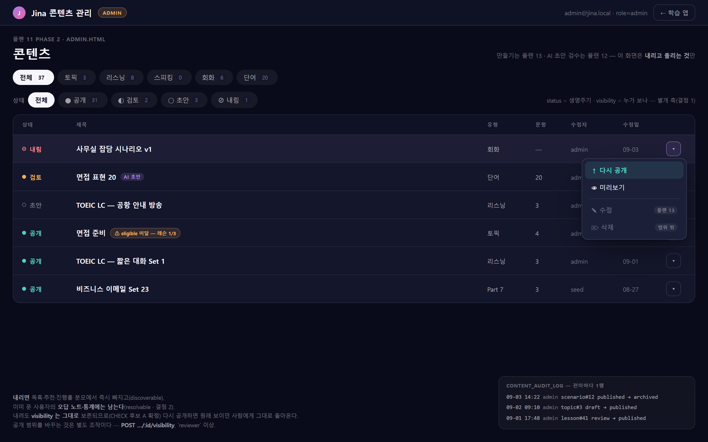
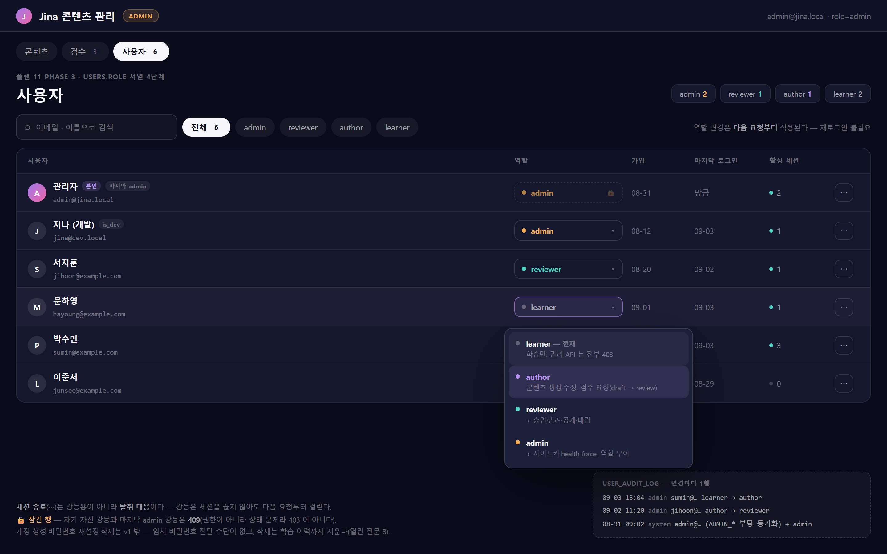

# 11 — 관리자 콘텐츠 ①: 상태 축 · 권한 · 최소 관리 UI (2026-09-03)

관리자(`users.role`, [10.7 §3.3](10.7-db-rebaseline.md))가 **주제별 학습 · 리스닝(LC) · 스피킹** 콘텐츠를 직접 만들고
공개/비공개를 관리한다. 지금 콘텐츠가 생기는 경로는 AI 생성 하나뿐이고 그 결과는 항상
`visibility='private'` 이라 **만든 사람만 본다** — 전체 사용자에게 보이는 콘텐츠를 만들 수단이 없다.

> **2026-09-03 분할.** 원래 한 문서(Phase 1~5)였던 "관리자 콘텐츠 저작·관리 플랜"을 성격이 다른 세 플랜으로 나눴다.
> 순서도 바꿨다 — 투입 대비 가치가 가장 높은 AI 검수를 에디터보다 앞에 둔다.
>
> | 플랜 | 내용 | 원래 Phase |
> |---|---|---|
> | **11 (이 문서)** | `status` 축 · 가시성 헬퍼 · `requireAdmin` 연결 · 내리고 올리는 최소 관리 UI | 1 · 2 |
> | [12](12-ai-draft-review.md) | AI 초안 → 검수 → 카탈로그 공개 (`publish_target`, `lesson_drafts.review_status` 살리기) | 4 |
> | [13](13-authoring-editors.md) | LC 에디터(최소형) · 토픽 구성 · 스피킹 세트(플랜 10 실측 통과 조건부) | 3 · 5 |
>
> 12 는 11 만 있으면 시작할 수 있고, 13 은 11 이 끝나야 한다(쓰기 API 가 11 의 상태 축을 전제).
>
> **2026-09-03 2차 개정.** [플랜 10.7](10.7-db-rebaseline.md)이 DB 를 새 baseline 으로 다시 잡으면서
> `content_items` 통합과 `status`·`visibility` 축을 **스키마 차원에서** 담당하게 됐다. 그래서 이 문서의
> 마이그레이션(`0017_content_status.sql`)과 스키마 결정 5건은 10.7 로 이관됐고, 11 은 **애플리케이션 계층**
> (가시성 헬퍼 · 표시부 · 관리 UI)만 남았다. Phase 1 은 이제 마이그레이션 0개다.

## 0. 출발점 — 이 플랜이 건드리는 것

- 콘텐츠 3종(레슨·회화 시나리오·단어 세트)은 **테이블이 이미 다 있다**. 새 엔진을 만들지 않는다.
- 없는 것은 **저작 경로 전부**: 쓰기 API, 공개 승격, 토픽 생성, 검수, 스피킹 콘텐츠의 실체.
  이 문서는 그중 **상태 축과 "내리기/올리기"** 만 만든다. 만들기(13)와 검수(12)는 그 위에 얹는다.
- 저작이 들어오면 **표시부(학습 화면 쪽 조회 규칙)가 함께 바뀐다.** 이 문서 분량의 절반이 §3이다.

## 1. 현재 상태 — 무엇이 이미 준비돼 있나

| 영역 | 준비된 것 | 없는 것 |
|---|---|---|
| 콘텐츠 저장소 | `lessons`+`lesson_items`, `conversation_scenarios`, `vocab_sets` — 셋 다 `source`(seed\|ai)·`visibility`(public\|private)·`created_by` 완비 | 쓰기 API 전무(라우트는 전부 GET). 콘텐츠를 INSERT 하는 코드는 `ai-job.service.js` **한 곳뿐** |
| 묶음 | `topics` + `topic_contents` — 배타 FK(`num_nonnulls(lesson_id, scenario_id, vocab_set_id) = 1`), `position`, 타깃별 부분 UNIQUE | 토픽 생성·구성 API 없음(0014 마이그레이션에 SQL 시드 1건이 전부) → 13 |
| AI 생성 | `ai_jobs`(lesson_gen·scenario_gen·vocab_set) + 인프로세스 워커(동시 2) + 자동 검증(`validateGeneratedLesson`·`validateLcScript`) + `lesson_drafts` | `lesson_drafts.review_status`(draft/approved/rejected)를 **바꾸는 코드가 없다** = 검수 워크플로 미구현. 저장 시 `'private'` 하드코딩 → 12 |
| 리스닝 | 레슨 엔진 재사용 구조(`kind='toeic_lc'`, 스크립트는 `passage.body` 화자 라벨 배열, `jinaSpeak` 재생) — 08 Phase B | 저작 화면 → 13 |
| 스피킹 | `listSpeakingSentences` — LC 스크립트·시나리오 opening·레슨 vocab 예문에서 문장을 **파생**하는 뷰 | **콘텐츠 테이블 자체가 없다.** → 13 (플랜 10 실측 조건부) |
| 권한 | `users.is_admin`(0016) 불리언, `/api/auth/me` DTO 에 포함, **`requireAdmin` 미들웨어는 플랜 10.5 Phase 1 산출물** | `users.role` 서열(10.7 §3.3 이 `is_admin` 을 대체), `requireRole`, `/api/admin/*` 네임스페이스 |
| 클라이언트 | `index.html`(앱) · `canvas.html`(디자인 캔버스) 2엔트리 + `src/shared/*` 공유 패턴 확립 | admin 엔트리 |

## 화면 미리보기 — 관리자 콘텐츠 시리즈 5화면

`admin.html` 은 학습 앱과 **별도 엔트리**다(결정 4). 그래서 목업도 학습 화면의 상단 내비(`APP_PAGES`)를
쓰지 않고 관리자 전용 바(제목 + `ADMIN` 배지 + 계정)를 쓴다 — 열었을 때 다른 앱이라는 것이 바로 보여야 한다.
다섯 화면 모두 **`admin` 으로 로그인한 상태**를 그렸다. 역할이 낮으면 보이는 조작이 줄어든다(결정 6·7).

| 화면 | 플랜 | 최소 역할 | 미리보기 | 목업 소스 |
|---|---|---|---|---|
| 콘텐츠 목록 · 상태 전이 | 11 Phase 2 | `author` (전이는 `reviewer`) | [`img/11-admin-contents.png`](img/11-admin-contents.png) | [`mockups/11-admin-contents.html`](mockups/11-admin-contents.html) |
| 사용자 · 역할 관리 | 11 Phase 3 | `admin` | [`img/11-admin-users.png`](img/11-admin-users.png) | [`mockups/11-admin-users.html`](mockups/11-admin-users.html) |
| AI 초안 검수 | [12](12-ai-draft-review.md) Phase 2 | `reviewer` | [`img/12-review-queue.png`](img/12-review-queue.png) | [`mockups/12-review-queue.html`](mockups/12-review-queue.html) |
| LC 에디터(최소형) | [13](13-authoring-editors.md) Phase A | `author` | [`img/13-lc-editor.png`](img/13-lc-editor.png) | [`mockups/13-lc-editor.html`](mockups/13-lc-editor.html) |
| 토픽 구성 | [13](13-authoring-editors.md) Phase B | `author` | [`img/13-topic-composer.png`](img/13-topic-composer.png) | [`mockups/13-topic-composer.html`](mockups/13-topic-composer.html) |

네 화면이 이어지는 순서는 플랜 순서와 같다. **목록**에서 있는 것을 내리고 올리다가(11),
`review` 로 떨어진 AI 초안은 **검수**로 넘어가고(12), 손봐야 하면 **에디터**로,
카탈로그를 새로 채울 때 **토픽 구성**으로 간다(13). 목록 화면의 `[▾]` 메뉴에 있는
"수정"·"삭제" 가 비활성으로 그려진 이유가 이 경계다.

### 콘텐츠 목록 · 상태 전이 (이 플랜 Phase 2)


읽을 것: 상태 4단계가 한 목록에 섞여 있고 **필터가 아니라 배지**로 구분된다. `eligible` 미달 토픽도
숨지 않고 경고만 단다(결정 3). 열린 `[▾]` 는 방금 내린 행이라 **다시 공개**가 첫 항목이고, 내릴 때
가시성을 건드리지 않으므로(열린 질문 7 → CHECK 후보 A 확정) 되올리면 원래 보이던 사람에게 그대로 돌아온다.
공개 범위 자체를 여닫는 것은 별도 조작(`POST …/:id/visibility`)이라 이 메뉴에 없다.
오른쪽 아래 `content_audit_log` 는 전이마다 1행이 쌓인다는 표시다.

### 사용자 · 역할 관리 (이 플랜 Phase 3)


읽을 것: 역할 셀이 곧 조작 지점이고, 드롭다운이 **각 역할이 무엇을 할 수 있는지**를 그 자리에서 설명한다 —
서열이라 아래 항목이 위 항목을 포함하므로 `+` 로 적었다. 첫 행의 자물쇠는 두 가드가 겹친 자리다(본인 · 마지막 admin).
오른쪽 위 문구가 이 화면의 전제를 말한다: **역할 변경은 다음 요청부터 적용되고 재로그인이 필요 없다.**
그래서 `⋯` 의 세션 종료는 강등용이 아니라 탈취 대응이다. 감사는 `content_audit_log` 가 아니라
`user_audit_log` 로 따로 간다 — 전자의 `content_id` 는 `content_items` 를 향한 진짜 FK 라 사용자를 못 가리킨다.

**목업 규칙 — 구현자가 지켜야 할 것**
- 목업은 `src/shared/tokens.jsx` 의 **aurora(Midnight Aurora) 토큰 사본**(`mockups/shared.css`)으로 그렸다.
  구현은 CSS 사본이 아니라 **`theme.*` 인라인 스타일**을 쓴다 — 4개 테마 전환이 깨지면 안 된다.
- 상태 색: 공개 `theme.success` · 검토 `theme.warning` · 초안 `theme.textDim` · 내림 `theme.error`.
- 역할 색: `admin` `theme.warning` · `reviewer` `theme.success` · `author` `theme.accent` · `learner` 무채색.
  두 대응 모두 다섯 화면에서 같다.
- 이모지 아이콘(▾ 👁 ✎ ⌕ ⋮⋮)은 **자리 표시자**다. 구현은 `src/shared/icons.jsx` 의 `Icons.*` 를 쓴다.
- 이미지 갱신: 목업 HTML을 고친 뒤 `node scripts/render-mockups.mjs`.

## 2. 설계 결정

> **스키마 결정은 [10.7](10.7-db-rebaseline.md) 로 이관됐다.** `content_items` 통합, `status` 4단계,
> `status × visibility` CHECK, 새 행 기본값 `draft`, 감사 로그 `content_audit_log`, `lessons.published` 폐지는
> 10.7 의 `0001_baseline.sql` 이 만든다. 이 절에는 그 위에서 **애플리케이션이 정해야 하는 것**만 남긴다.
> 아래 1은 10.7 이 만든 스키마의 요약(참조용)이고, 2~5가 이 플랜의 실제 결정이다.
> 이관 전 원문은 git 이력(`11-content-lifecycle-admin.md` 초판)에 있다.

1. **(10.7 이 제공) 상태 축과 콘텐츠 카탈로그.** 콘텐츠 4종은 `content_items` 한 테이블에 살고
   `status TEXT (draft|review|published|archived)` · `visibility (public|private)` 를 가진다.
   `CHECK (status = 'published' OR visibility = 'private')` 로 "공개 상태가 아닌데 public" 은 저장되지 않고,
   새 행 기본값은 `draft` 다. `topic_contents` 는 `(topic_id, content_id)` 단일 FK 이고,
   `lessons.published` 는 존재하지 않는다.
   의미를 못 박는다: **`status` = 생명주기(작성자·관리자 관점), `visibility` = 누가 볼 수 있나.**

2. **가시성 조건은 단일 소스 `api/lib/content-scope.js` 로 뽑되, 헬퍼는 두 개다.**
   현재 `visibility = 'public' OR created_by` 조건이 **27곳**(topic 13 · lesson 10 · speaking 3 · ai-job 1),
   `published` 가 20곳에 흩어져 있다. 뽑지 않으면 "관리자가 내렸는데 어떤 화면엔 계속 보이는" 버그가 반드시 난다.
   그런데 **모든 쿼리가 같은 규칙을 원하지 않는다**:
   두 헬퍼 모두 [10.7 §3.4](10.7-db-rebaseline.md) 공통 컬럼의 **`NOT is_deleted AND is_active` 를 함께 건다** —
   빠뜨리면 지우거나 사용 중지한 콘텐츠가 화면에 남는다. 조건을 헬퍼 밖에서 손으로 쓰지 않는 이유가 이것이다.
   - `discoverable(alias, userParam)` — `status = 'published' AND (visibility = 'public' OR created_by = $n)`.
     목록·추천·토픽 구성·진행률 **분모**·새 시도 시작. "지금 학습할 수 있는 것".
   - `resolvable(alias, userParam)` — `status IN ('published','archived') AND (…같은 가시성…)`.
     오답 노트·통계·Q&A·이미 있는 attempt/session 의 상세. "이미 한 것의 근거".
     내린 레슨을 오답 노트가 조인에서 떨어뜨리면 **사용자의 오답이 사라진다**(원문 열린 질문 2) —
     이것은 열린 질문이 아니라 Phase 1 의 선결 규범이다: **archived 는 이력에는 남고, 새 시도만 막는다.**
   §3 표의 "헬퍼" 열이 쿼리마다 어느 쪽인지 지정한다. 저작 기능보다 이 정리가 먼저다(Phase 1 을 UI 없이 두는 이유).
3. **토픽 노출은 `status` 가 결정하고, `eligible` 임계치는 경고로 격하한다.**
   지금 `topicDto` 의 임계치(레슨 3 + 시나리오 1 + 단어 20)를 못 채운 토픽은 목록에서 아예 숨는다 —
   관리자가 토픽을 새로 만들면 **콘텐츠를 다 채우기 전까지 화면에 안 보여** 저작이 막힌다.
   임계치 계산은 유지하되(집계는 그대로 쓸모 있다) 필터가 아니라 admin 화면의 배지로 쓴다.
4. **admin 클라이언트는 별도 엔트리(`admin.html`)로 분리한다.** `canvas.html` 선례를 따른다.
   - 학습 앱 번들에 저작 UI가 섞이지 않는다(`index.html` 은 이미 script 21개 + babel standalone 런타임 컴파일).
   - 일반 사용자 브라우저에 admin 코드가 전달되지 않는다.
   - `APP_PAGES`(`app-nav.jsx` 단일 소스)에 손대지 않는다. 진입은 **설정 화면의 "콘텐츠 관리" 링크(새 탭)** 한 줄, `author` 이상일 때만.
   - `admin.html` 자체에는 가드를 두지 않는다 — 인증을 클라이언트에 맡기지 않는다. 열려도 모든 `/api/admin/*` 이 403이면 빈 화면이다.
   - **비용을 적어 둔다**: HTML 진입점이 셋이 되고 `<script>` 태그 순서를 세 파일에서 수동 동기화한다.
     빌드 단계를 도입할 마지막으로 싼 시점이다(열린 질문 4).
5. **`requireAdmin` 과 `content_audit_log` 는 만들지 않고 쓴다.** 전자는 플랜 10.5 Phase 1 이
   `api/middleware/auth.js` 에 추가하고, 후자는 10.7 baseline 이 만든다(행위자 `created_by` 는 `ON DELETE SET NULL` —
   append-only 로그가 관리자 삭제로 사라지지 않게). 이 플랜은 **상태 전이마다 로그 1행을 쓰는 것**만 담당한다.
   콘텐츠 본문 리비전(되돌리기)은 v1 범위 밖 — 열린 질문 3.

6. **누가 승인하는가 — `users.role` 서열 4단계.**
   `is_admin` 불리언은 "만드는 사람"과 "그것을 승인하는 사람"을 구분하지 못한다. 게다가 같은 플래그가
   10.5 의 **시스템 조작**(사이드카 설치·프로세스 스폰)까지 겸해서, 위험도가 다른 둘을 한 열쇠로 연다.
   [10.7 §3.3](10.7-db-rebaseline.md) 이 baseline 에서 `role` 로 대체한다.

   | role | 콘텐츠 | 승인 | 시스템 |
   |---|---|---|---|
   | `learner` (기본) | — | — | — · `/api/admin/*` 전부 403 |
   | `author` | 생성·수정, 검수 요청 | — | — |
   | `reviewer` | 〃 | 승인·반려·공개·내림 | — |
   | `admin` | 〃 | 〃 | 사이드카·health force(10.5), 역할 부여 |

   **서열이므로 검사는 `rank(user.role) >= rank(required)` 한 줄이다.** 다대다 `user_roles` 테이블을
   만들지 않는 이유는 이 앱의 권한 질문이 전부 "이 이상인가?" 하나이기 때문이다. 1인 운영에서 admin
   하나면 지금과 똑같이 동작하고, 사람이 늘 때 열 하나만 바꾸면 분리가 시작된다.
   미들웨어는 `requireRole('author'|'reviewer'|'admin')` 하나로 통일하고, 10.5 가 만든 `requireAdmin` 은
   `requireRole('admin')` 의 별칭으로 남긴다(10.5 결정 1 이 판정을 술어 하나로 격리해 둔다).

7. **전이 권한은 `api/lib/content-status.js` 단일 소스로 둔다 — `canTransition(from, to, role)`.**
   조회 조건을 27곳에서 `content-scope.js` 로 모은 것과 같은 이유다. 지금 11 의 API 는 `{ to }` 만 받아
   **어떤 `from` 에서 오는지도, 누가 누르는지도** 검사하지 않는다.

   | 전이 | 의미 | 최소 역할 |
   |---|---|---|
   | `draft → review` | 검수 요청 | `author` |
   | `review → published` | 승인 | `reviewer` |
   | `review → draft` | 반려 — 사유는 audit `note` | `reviewer` |
   | `draft → published` | 검수 생략 발행 | `reviewer` |
   | `published → archived` | 내림 | `reviewer` |
   | `archived → published` | 다시 올림 | `reviewer` |
   | `visibility ↔ public/private` | 공개 여닫기 | `reviewer` |
   | `published → draft` | — | **금지** — `archived` 를 거친다 |

   이 표가 "수기 저작은 검수를 건너뛰는가" 를 푼다: `draft → published` 를 **막지 않되 `reviewer` 이상으로
   묶는다.** 1인(admin) 운영에서는 지금처럼 바로 발행되고, `author` 가 생기는 순간 그 사람은 자동으로
   `draft → review` 까지만 할 수 있게 된다. 상태를 늘리지 않고 역할로 게이트를 건 것이다.

8. **승인 상태의 단일 소스는 `content_items.status` 다 — `lesson_drafts.review_status` 는 쓰지 않는다.**
   `review_status`(0012)는 지금 죽은 컬럼이고(`api/` 에서 읽지도 쓰지도 않는다), 살리면 레슨만 상태 축이
   둘이 된다 — 10.7 이 `lessons.published` 를 없앤 이유가 그대로 재발한다. 더 큰 문제는 **시나리오·단어 세트에는
   그 컬럼이 없어서** 반려를 기록할 자리가 없다는 것이다.
   그래서 세 종류 모두 같은 규칙을 쓴다: **큐 = `status='review'` 행, 반려 = `review → draft` 전이,
   사유 = `content_audit_log.description`.** 누가 언제 승인/반려했는지는 감사 로그가 이미 담는다.
   `review_status` 는 10.7 baseline 에서 빼거나(권장), 남기더라도 판정에 쓰지 않는다.

9. **검수는 4-eyes 가 아니라 저장 전 게이트다 — 지금은.**
   관리자가 사실상 한 명이므로 만든 사람이 자기 것을 승인한다. 이것을 막으면 1인 운영이 불가능해지므로
   기본값은 허용이되, **사실을 남기고 켤 수 있게** 한다: 승인 시 콘텐츠의 `created_by` 가 행위자와 같으면 감사 로그에
   `self_review: true` 를 남기고, `REQUIRE_SEPARATE_REVIEWER`(기본 `false`)를 켜면 자가 승인이 403 이 된다.
   사람이 늘었을 때 코드가 아니라 설정을 바꾸면 되도록 자리만 만들어 두는 것이다.

## 3. 표시부 변경 목록 — 저작과 같은 크기의 작업

`status` 축이 들어가는 순간 학습 화면 쪽 조회가 전부 바뀐다. Phase 1에서 **한 번에** 처리한다.
"헬퍼" 열은 결정 2 의 두 헬퍼 중 어느 쪽인지다 — **표에 없는 쿼리를 만나면 먼저 이 열을 채운다.**

| 파일 | 지금 | 바뀌는 것 | 헬퍼 | 놓치면 생기는 일 |
|---|---|---|---|---|
| `api/lib/content-scope.js` | (없음) | `discoverable` / `resolvable` 신설 — 조건 문자열을 만드는 단일 소스 | — | — |
| `api/services/topic.service.js` | 가시성 조건 13곳(`TOPIC_SUMMARY`·`getTopic` 4쿼리·진행률 CTE 3개) | 전부 헬퍼 경유. **진행률 CTE 분모도 같은 규칙**(이미 주석으로 명시된 규범) | 목록·상세·분모: discoverable | 내린 콘텐츠가 진행률 분모에 남아 100%가 안 됨 |
| 〃 `topicDto` | `eligible` 로 목록 필터 | 필터는 `status`, `eligible` 은 DTO 필드로만 유지(경고 배지용) | discoverable | 관리자가 만든 빈 토픽이 안 보여 저작 불가(결정 3) |
| `api/services/lesson.service.js` | 가시성 10곳 + `l.published` 4곳(목록·추천·오답·Q&A) | 헬퍼 경유. `published` → `status` | 목록·추천·attempt 시작: discoverable / 오답 노트·Q&A·attempt 상세: **resolvable** | 내린 레슨을 추천이 계속 노출 · 또는 반대로 오답 노트에서 사용자의 오답이 사라짐 |
| `api/services/progress.service.js`, `dashboard.service.js` | 레슨 조인에 `published` 조건 | 헬퍼 경유 | **resolvable** (이미 푼 것의 집계) | 내린 레슨의 점수가 통계에서 증발 |
| `api/services/speaking.service.js` | 가시성 3곳, LC/시나리오/vocab 파생 | 조건만 헬퍼 경유(재작성은 13) | discoverable | — |
| `api/services/ai-job.service.js` | `assertTopicAccess` 1곳, 저장 시 `'private'` 하드코딩 | 헬퍼 경유. 저장은 `status` 명시(`'published'`+`'private'` — 지금 동작 유지). `publish_target` 은 12 | discoverable | 기본값 함정(결정 1) — `status` 안 쓰면 draft 로 저장돼 사용자가 자기 생성물을 못 봄 |
| `src/screens/topics.jsx` | 목록/상세 렌더 | 빈 상태 문구. `eligible` 배지는 앱에서는 렌더하지 않는다(관리자 화면 전용) | — | — |
| `src/screens/listening.jsx` | `GET /api/lessons?kind=toeic_lc` | 쿼리 그대로 동작 | — | — |
| 설정 패널 (05 플랜 화면) | 계정·테마·AI·STT 4섹션 | `author` 이상일 때 "콘텐츠 관리 열기"(`admin.html`, 새 탭) 1줄 | — | — |
| `api/routes/auth.routes.js` `/api/auth/me` DTO | `is_admin` 불리언 | `role` + 편의 불린 `can_author`·`can_review`·`can_admin` | — | 클라이언트가 서열을 직접 계산하면 규칙이 두 곳이 된다 |
| `db/migrate.mjs` `RESET_TABLES` | 23개 수기 목록 | **변경 없음** — 10.7 이 `DROP SCHEMA … CASCADE` 로 대체해 목록 자체가 사라진다(§5) | — | — |

## 4. Phase 플랜

### Phase 1 (3~4일) — 상태 축 + 헬퍼 2종 + 표시부 정리 (**UI 없음**)

| 산출물 | 세부 |
|---|---|
| (마이그레이션 없음) | 스키마는 10.7 `0001_baseline.sql` 이 이미 제공한다 — `content_items` · `status` · CHECK · `content_audit_log` |
| `api/lib/content-scope.js` | `discoverable` / `resolvable`. 27+20곳을 여기로 — §3 "헬퍼" 열대로 |
| `api/lib/content-status.js` | `canTransition(from, to, role)` — 결정 7 의 전이표 단일 소스. 금지 전이는 `409 CONFLICT`, 역할 부족은 `403 FORBIDDEN` 으로 구분한다 |
| `requireRole` (`api/middleware/auth.js`) | 결정 6 의 서열 검사. 10.5 가 만든 `requireAdmin` 을 `requireRole('admin')` 별칭으로 정리 |
| `/api/auth/me` DTO | `is_admin` → `role` + `can_author`·`can_review`·`can_admin` |
| 표시부 일괄 수정 | §3 표 전부 |
| 검증 `scripts/verify-content-status.mjs` | 아래 세 묶음 |

**검증 — 무회귀만으로는 부족하다.** 시드 콘텐츠가 전부 `published` 이므로 "헬퍼 도입 전후 목록 결과 동일" 은
새 헬퍼가 `status` 를 **아예 무시하는 버그**가 있어도 통과한다. Phase 1 에는 쓰기 API 가 없으니 스크립트가 DB 에 직접
픽스처를 심는다(`e2e-topics.mjs` 의 DB 직접 접근 선례). 10.7 Phase 1 의 테스트 하네스가 있으면 이 픽스처는
서버 없이 도는 단위 테스트로 쓰는 편이 빠르다.

1. **무회귀** — 헬퍼 도입 전후 `GET /api/lessons`·`/api/topics`·`/api/dashboard`·`/api/progress`·`/api/mistakes` 응답 동일.
2. **음성 픽스처** — 레슨·시나리오·단어 세트·토픽 각 1행을 `draft`(private), 1행을 `archived`(**public**, 다른 사용자 소유)로 INSERT.
   `archived + public` 이 저장되는 것 자체가 열린 질문 7 확정안(CHECK 후보 A)의 첫 단정이다 —
   초기 초안의 CHECK 였다면 이 INSERT 가 거부되어 아래 `resolvable` 검증을 아예 못 했다.
   - `draft` 는 **모든** 학습 API 에서 0건(목록·추천·토픽 상세·진행률 분모·오답 노트·통계).
   - `archived` 레슨에 기존 attempt 를 심어 두면 **오답 노트·통계에는 남고**(resolvable), 목록·추천·분모에서는 빠진다(discoverable).
     이 한 줄이 결정 2 의 검증이다.
   - `review + public` INSERT 시도 → CHECK 위반(결정 1).
   - `status` 생략 INSERT → `draft` 로 저장(결정 1).
3. **권한 — 역할 × 전이 매트릭스**(결정 6·7). 계정 4개(`learner`·`author`·`reviewer`·`admin`)를 심고 전이표를 그대로 단정한다.
   - `learner` 는 `/api/admin/*` 전부 403(라우트는 Phase 2 지만 네임스페이스 가드는 여기서 선등록).
   - `author` 는 `draft → review` 200, `review → published` **403**, `published → archived` **403**.
   - `reviewer` 는 위 셋 다 200. `admin` 은 추가로 10.5 의 사이드카 라우트 200(`reviewer` 는 403 — 축이 갈렸다는 증거).
   - 금지 전이 `published → draft` 는 역할과 무관하게 **409**(403 이 아니다 — 권한이 아니라 상태 문제).
   - 자가 승인: 콘텐츠의 `created_by` 가 행위자와 같은 채로 승인하면 감사 로그에 `self_review = true`.
     `REQUIRE_SEPARATE_REVIEWER=1` 로 켜면 같은 요청이 403(결정 9).

완료 판정: 기존 e2e(`e2e-lesson`·`e2e-dashboard`·`e2e-plan08-screens`·`e2e-topics`) 전부 무회귀 + 위 검증 스크립트 통과. **UI 변경 0.**

### Phase 2 (3일) — `admin.html` 최소 관리 UI (제작 아님, **관리부터**)

```
┌ Jina 콘텐츠 관리 ─────────────────────────────── admin ─┐
│ [토픽] [리스닝] [스피킹] [회화] [단어]                       │
│ ┌─────────────────────────────────────────────────────┐ │
│ │ 상태  제목                     유형   문항  수정일     │ │
│ │ ●공개 TOEIC LC — 짧은 대화 Set1  LC     3   09-01  [▾] │ │
│ │ ○초안 비즈니스 이메일 Set 24     Part7  3   09-02  [▾] │ │
│ │ ◐검토 (AI) 면접 표현 20          단어   20  09-03  [▾] │ │
│ └─────────────────────────────────────────────────────┘ │
│ [▾] = 공개 / 내림 / 미리보기                              │
└───────────────────────────────────────────────────────┘
```

[+ 새로 만들기]·삭제는 이 Phase 에 없다 — 만들기는 13, 검수는 12. 여기서는 **있는 것을 내리고 올리는 것**만.

| 산출물 | 세부 |
|---|---|
| `admin.html` | `index.html` 과 같은 뼈대. `src/shared/` 의 tokens·icons·api-client·auth-store 재사용, 학습 화면은 로드하지 않는다 |
| `src/admin/admin-app.jsx` · `content-store.jsx` | 유형 탭 · 목록 · 상태 전이. `author` 미만이면 안내 화면. 조작은 `can_review` 로 가림(전이 버튼은 `reviewer` 부터) |
| `api/routes/admin.routes.js` | `GET /api/admin/contents?type=&status=`, `POST /api/admin/contents/:type/:id/status {to}` — 전이는 `content_audit_log` 에 기록(트랜잭션) |
| `server.js` | `admin.html` 정적 서빙(기존 deny-list 유지). `/config.js` 는 그대로 |
| 설정 패널 링크 | `can_author` 일 때만 |

완료 판정: 관리자가 기존 콘텐츠를 **내리고 다시 올릴 수 있고**, 내린 즉시 학습 화면 목록·추천·진행률 분모에서 사라지되
그 레슨을 이미 푼 사용자의 오답 노트·통계에는 남는다(§3 검증). 비관리자는 목록 API 403. 전이마다 감사 로그 1행.

### Phase 3 (1일) — 사용자 · 역할 관리

결정 6 이 도입한 서열을 **실제로 부여할 수단**이다. 지금은 `.env` 부팅 동기화로 `admin` 하나가 생길 뿐이라,
두 번째 사람에게 `author` 를 주려면 DB 를 직접 만져야 한다. 화면 하나면 끝나고 Phase 2 의 `admin.html`
껍데기를 그대로 쓴다.

| 산출물 | 세부 |
|---|---|
| `GET /api/admin/users` | `admin`. 목록 + 검색(email·display_name) + role 필터. 행마다 활성 세션 수(`auth_sessions` 에서 `revoked_at IS NULL AND expires_at > now()` 집계) |
| `PATCH /api/admin/users/:id/role` | `admin`. `user_audit_log(action='role_change', from_role, to_role)` 1행. 두 가드는 §5 |
| `PATCH /api/admin/users/:id/active` | `admin`. `is_active` 토글 = **사용 중지/재개**. `user_audit_log(action='disable'\|'enable')` |
| `POST /api/admin/users/:id/sessions/revoke` | `admin`. 그 사용자의 세션 전부 `revoked_at = now()`. 계정 탈취 대응용 — 강등·사용중지는 이게 필요 없다(아래) |
| `src/admin/users.jsx` | 목록 · 역할 드롭다운 · 사용 중지 · 세션 종료. `admin.html` 에 탭 하나 추가 |

**역할을 낮추거나 계정을 중지하면 즉시 적용된다 — 세션을 끊을 필요가 없다.** `resolveSession`
(`auth.service.js:80`)이 요청마다 `auth_sessions JOIN users` 로 사용자 행을 다시 읽기 때문이다.
`role` 과 `is_active` 가 같은 경로를 타므로 WHERE 에 `u.is_active AND NOT u.is_deleted` 한 줄을 더하면 끝난다.
세션 종료 버튼은 그래서 강등용이 아니라 **탈취된 세션을 끊는 용도**다.
이 성질이 깨지지 않도록 `role` 을 세션 토큰에 싣지 않는다(10.7 §3.3).

**v1 에 넣지 않는 것과 이유**: 계정 생성·비밀번호 재설정은 임시 비밀번호를 전할 수단(메일)이 없어 반쪽이 된다.
삭제는 `ON DELETE CASCADE` 가 학습 이력을 함께 지우므로 비활성화가 먼저이고, 그 컬럼이 아직 없다(열린 질문 8).

완료 판정: `learner` 계정을 `author` 로 올리면 **그 계정의 다음 요청부터** `/api/admin/contents` 가 200 이 되고
(재로그인 없이), `reviewer` 로 올리기 전에는 `→ published` 전이가 403 이다. 마지막 `admin` 강등과 자기 강등은 409.
모든 변경이 `user_audit_log` 에 남는다.

## 5. 구현자 메모

### 스키마 — 10.7 이 만든다

`content_items` · `status` · `status × visibility` CHECK · 새 행 기본값 `draft` · `content_audit_log` ·
`topic_contents (topic_id, content_id)` 는 [10.7 §3.2](10.7-db-rebaseline.md) 의 `0001_baseline.sql` 산출물이다.
**이 플랜은 마이그레이션을 만들지 않는다.** `db/migrate.mjs` 의 `RESET_TABLES` 수기 목록도 10.7 에서
`DROP SCHEMA … CASCADE` 로 대체돼 갱신할 것이 없다.

10.7 이 아직 착수 전이라면 두 갈래가 있다: (a) 10.7 을 먼저 끝낸다(권장 — 이 플랜의 47곳 수정을 10.7 이
이미 건드리므로 두 번 고치지 않는다), (b) 옛 스키마 위에 `0017_content_status.sql` 로 `status` 만 얹는다
(이 문서 이전 개정판의 §5 SQL, git 이력 참조).

### API 표면 (이 플랜 범위)

```
GET    /api/admin/contents?type=lesson|scenario|vocab_set&status=   author+
POST   /api/admin/contents/:type/:id/status      { to }             전이표(결정 7)가 최소 역할을 정한다
POST   /api/admin/contents/:type/:id/visibility  { to }             reviewer+
PATCH  /api/admin/users/:id/role                 { to }             admin
```

생성·수정(`POST`/`PATCH …/:type`)은 13, `drafts` 는 12.
전 경로 최소 `requireRole('author')` 이고, **역할 판정은 라우트가 아니라 `canTransition` 이 한다** —
같은 엔드포인트라도 `to` 에 따라 필요한 역할이 다르기 때문이다(`draft → review` 는 author, `→ published` 는 reviewer).
변경 요청은 기존 `X-Requested-With: jina` CSRF 규칙을 그대로 탄다.

`PATCH /api/admin/users/:id/role` 은 두 가지를 **409 CONFLICT** 로 막는다(권한이 아니라 상태 문제라 403 이 아니다):

- **자기 자신의 강등** — 실수로 자기 권한을 내려 화면에서 튕기는 것을 막는다. 내리려면 다른 admin 이 한다.
- **마지막 `admin` 의 강등** — `SELECT count(*) FROM users WHERE role = 'admin'` 이 1이면 거부.
  두 가드가 겹쳐 admin 이 하나뿐일 때는 그 계정의 역할 셀이 아예 잠긴다. 아무도 못 들어가는 상태를 만들지 않기 위해서다.
  최후 수단은 `.env` `ADMIN_*` 부팅 동기화(0016)이고, 그것이 `role='admin'` 을 다시 세운다.

역할 변경은 감사 대상이므로 `user_audit_log`(10.7 §3.3)에 1행을 남긴다 — `content_audit_log` 는 `content_id` 가
`content_items` 를 향한 진짜 FK 라 사용자를 가리킬 수 없다.

### 먼저 하지 말 것

- 새 콘텐츠 엔진 — 리스닝은 레슨 엔진 재사용(08 §2.3), 저작도 같은 테이블에 쓴다.
- 만들기·삭제 UI — 13. 검수 큐 — 12.
- 콘텐츠 본문 리비전/되돌리기 — 감사 로그는 **상태 전이만** 남긴다(열린 질문 3).
- 역할을 다대다 권한 세트로 넓히는 것 — 서열 4단계로 시작한다(결정 6).
- 관리자 대행 **계정 생성·비밀번호 재설정** — 임시 비밀번호를 전달할 수단(메일)이 없다. Phase 3 참조.
- 사용자 **삭제** — `users` 를 지우면 `ON DELETE CASCADE` 로 학습 이력까지 사라진다. 비활성화가 먼저이고
  그 컬럼이 아직 없다(열린 질문 8).
- `admin.html` 을 학습 앱 라우팅(`APP_PAGES`)에 편입하는 것(결정 4).

## 6. 열린 질문

1. ~~AI 검수 승인 시 `visibility`~~ → 12 로 이동.
2. ~~`archived` 콘텐츠와 학습 이력~~ → **결정 2 로 확정**(이력에는 남고 새 시도만 막는다). 남은 세부: archived 레슨의
   오답 카드에서 "다시 풀기" 버튼을 숨길지, 눌렀을 때 안내를 띄울지.
3. **본문 리비전** — 공개된 콘텐츠를 수정했을 때 되돌릴 수단. v1은 감사 로그(상태 전이)만 남기고 본문 스냅샷은 두지 않는다.
4. **빌드 단계** — `admin.html` 로 HTML 진입점이 셋이 된다. 이 시점에 번들러를 들이지 않으면 13 의 에디터까지 Babel
   런타임 컴파일 위에 쌓인다. 결정 4 의 비용 항목.
5. ~~`lessons.published` 처리~~ → **10.7 에서 해소**. baseline 에 `published` 컬럼이 없다(축은 `status` 하나).
6. ~~seed 콘텐츠와 마이그레이션~~ → **10.7 Phase 2 에서 해소**. 콘텐츠 시드가 `db/content/*.json` +
   import 스크립트로 나오므로 관리자 편집과 `db:reset` 이 충돌하지 않는다.
7. ~~**10.7 의 CHECK 가 결정 2 의 `resolvable` 을 무력화한다**~~ → **후보 A 로 확정**
   ([10.7 §3.2](10.7-db-rebaseline.md), 2026-09-03). `CHECK (status IN ('published','archived') OR visibility = 'private')`.
   초안(`status = 'published' OR …`)은 `archived` 행을 강제로 `private` 으로 만들어, 시드 레슨을 푼 학습자가
   작성자가 아니라는 이유로 **오답 노트에서 그 레슨을 잃게** 했다. 좁힌 형태는 draft·review 의 오발행 방지를
   유지하면서 archived 가 이전 가시성을 보존한다. 파생 문제였던 (a) 내렸다 올릴 때 `private` 에 갇히는 것과
   (b) 감사 로그에 이전 가시성이 없는 것도 함께 사라졌다 — 애초에 가시성을 건드리지 않기 때문이다.
   남은 것은 공개 조작 엔드포인트인데 §5 에 `POST …/:id/visibility` 로 넣었다.
8. ~~**계정 비활성화 컬럼**~~ → **공통 컬럼 `users.is_active`·`is_deleted` 로 해소**
   ([10.7 §3.4](10.7-db-rebaseline.md) 공통 컬럼 규약, 2026-09-03). `resolveSession` 의 WHERE 에
   `u.is_active AND NOT u.is_deleted` 한 줄이면 `role` 과 같은 경로로 즉시 차단된다. Phase 3 의 `⋯` 메뉴에
   "사용 중지" 가 들어가고 `user_audit_log(action='disable')` 이 언제 누가를 남긴다.
   남은 세부: 사용 중지 계정의 학습 이력을 통계 집계에서 뺄지(빼면 전체 지표가 흔들리고, 두면 유령 사용자가 남는다).
