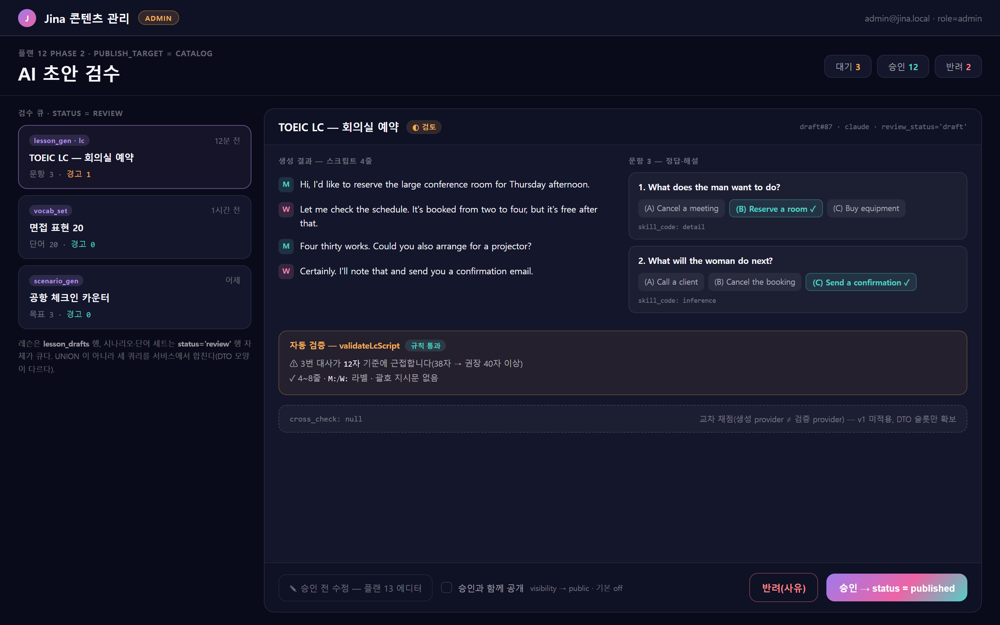

# 12 — 관리자 콘텐츠 ②: AI 초안 → 검수 → 카탈로그 공개 (2026-09-03)

[플랜 11](11-content-lifecycle-admin.md) 이 만든 `status` 축 위에 **검수 단계**를 얹는다.
원문 플랜의 Phase 4 를 독립시키고 **에디터(13)보다 앞으로** 옮겼다.

## 0. 왜 에디터보다 먼저인가

지금 콘텐츠가 생기는 유일한 경로는 AI 생성(`ai_jobs` → `lesson_drafts` 검증 → `lessons`)이고, 결과는 전부
`visibility='private'` 라 **만든 사람만 본다**. 파이프라인·자동 검증·`lesson_drafts.review_status` 컬럼까지 이미 있는데
`review_status` 를 바꾸는 코드가 없어 죽은 컬럼이다. 여기에 "관리자가 승인하면 카탈로그로" 한 단계만 붙이면
**전체 사용자에게 보이는 콘텐츠가 처음으로 생긴다.** 수기 에디터는 1주짜리 UI 인데 AI 가 이미 만들어 주는 것을
손보는 용도라, 투입 대비 가치가 이쪽이 크다.

## 화면 미리보기

목업 소스 [`mockups/12-review-queue.html`](mockups/12-review-queue.html) · 규칙은 [11 의 목업 절](11-content-lifecycle-admin.md#화면-미리보기--관리자-콘텐츠-시리즈-4화면).

읽을 것: 승인 버튼이 `승인 → status = published` 라고 **가는 상태를 그대로 적는다** — 이 화면은
`visibility` 를 건드리지 않는다(결정 2). 그 옆 "승인과 함께 공개" 체크박스가 기본 off 이고,
켜야 비로소 `public` 이 된다. 왼쪽 큐는 레슨(`lesson_drafts` 행)과 시나리오·단어 세트(`status='review'` 행)를
한 목록으로 합쳐 보여주지만 **UNION 이 아니라 서비스에서 합친 세 쿼리**다(구현자 메모).
`cross_check: null` 슬롯은 07 follow_up 의 교차 채점이 들어올 자리이고 v1 에는 비어 있다.
"승인 전 수정" 은 13 이 생기기 전까지 비활성이다(결정 4).

## 1. 설계 결정

1. **AI 파이프라인은 재사용한다 — 새 잡 종류를 만들지 않는다.**
   `ai_jobs.input` 에 `publish_target: 'personal' | 'catalog'` 를 추가하고 `catalog` 는 **`author` 이상**에게 허용한다
   (`learner` 요청은 400). 만드는 권한이지 통과시키는 권한이 아니다 — 결과가 `review` 로 떨어져 `reviewer` 를 기다린다(결정 6). 워커의 저장 함수가 `'private'` 로 하드코딩한 자리에 이 값을 반영해
   catalog 요청은 `status='review'` + `visibility='private'` 로 떨어뜨린다(11 결정 1 의 CHECK 가 `review + public` 을 막는다).
   personal 은 지금과 동일(`published` + `private`).
2. **승인은 두 단계다 — `published` 로 올리는 것과 `public` 으로 여는 것.** 원문 열린 질문 1 의 답.
   승인(`approve`)은 `status='published'` 만 바꾸고 `visibility` 는 `private` 로 둔다. 공개는 11 Phase 2 의
   상태 전이 화면에서 한 번 더 누른다(`visibility → public`). 이유: 오발행 방지, 그리고 "승인은 했지만 특정 토픽에
   묶은 뒤에 공개" 같은 순서가 자연스러워진다. 한 번에 하고 싶으면 승인 화면의 체크박스(기본 off).
3. **반려(`reject`)는 `review → draft` 전이이고, 사유는 `content_audit_log.description` 에 남는다.**
   ~~`lesson_drafts.review_status='rejected'`~~ 를 쓰지 않는다 — 그 컬럼은 레슨에만 있어서 **시나리오·단어 세트의
   반려를 기록할 자리가 없고**, 살리면 레슨만 상태 축이 둘이 된다(11 결정 8).
   그래서 세 종류가 같은 규칙을 쓴다: **큐 = `status='review'` 행**, 반려 = `draft` 로 되돌림, 사유 = 감사 로그.
   되돌아간 초안은 `discoverable` 에 걸리지 않으므로 학습 API 에는 계속 0건이고, 관리자는 목록에서 `초안` 으로 본다.
   레슨의 `lesson_drafts` 행은 생성 산출물·`validation_errors` 보관용으로만 남는다(검수 큐의 근거 데이터).
4. **검수 화면은 편집하지 않는다(v1).** 생성 결과와 `validation_errors` 를 나란히 보여주고 승인/반려만.
   "승인 전 수정" 은 13 의 에디터가 생기면 링크로 연다. 그때까지는 반려 → 재생성.
5. **감사 로그**: approve/reject 는 `content_audit_log(action='status_change')` 에 남긴다(11 결정 5).
6. **승인 주체는 `reviewer` 이상이다**(11 결정 6·7). `catalog` 생성 요청은 `author` 이상이면 되지만
   승인·반려·공개는 `reviewer` 부터다 — 만드는 권한과 통과시키는 권한을 갈라 두는 것이 이 시리즈에서
   역할을 도입한 이유다. 1인 운영(admin 하나)에서는 두 권한이 한 사람에게 있으므로 지금과 동작이 같고,
   그때는 감사 로그에 `self_review: true` 가 남는다(11 결정 9). `REQUIRE_SEPARATE_REVIEWER` 를 켜면
   자기가 만든 초안의 승인이 403 이 되고, 검수 화면은 그 버튼을 비활성으로 그린다.

## 2. Phase 플랜

### Phase 1 (2일) — `publish_target` · 워커 분기 · 검수 API

| 산출물 | 세부 |
|---|---|
| `api/services/ai-job.service.js` | `input.publish_target` 검증(`personal` 기본, `catalog` 는 `author` 이상), `request_hash` 에 포함(같은 입력이라도 target 이 다르면 다른 job) |
| `api/services/ai-job-worker.js` | 저장 분기 — catalog → `status='review'`, personal → 지금과 동일. `status` 는 **항상 명시**(11 결정 1 의 기본값 함정) |
| `api/routes/admin.routes.js` | `GET /api/admin/drafts` (lesson_drafts + review 상태 시나리오·단어 세트 통합 목록), `POST /api/admin/drafts/:id/approve\|reject` |
| `lesson_drafts.review_status` | approve → `approved` + `lessons.status='published'`; reject → `rejected`, lessons 무변경 |

완료 판정(`verify-lesson-gen.mjs` 확장): 관리자 catalog 생성 → `status='review'` 행이 **어떤 학습 API 에도 0건** →
approve → `published + private`(관리자만 봄) → 11 의 전이로 `public` → 학습자 계정 목록에 노출. 비관리자 catalog 요청 400.
reject → `lessons` 행 수 불변, `review_status='rejected'`. `review_status` 가 실제로 바뀐다(현재 죽은 컬럼).

### Phase 2 (2일) — 검수 화면

| 산출물 | 세부 |
|---|---|
| `src/admin/review-queue.jsx` | 큐 목록 → 상세(생성 결과 렌더 + `validation_errors`) → [승인] [반려(사유)] · "승인과 함께 공개" 체크박스(기본 off) |
| 레슨 목록의 "AI로 만들기" 패널 | `can_author` 면 대상 선택(내 것 / 카탈로그) 라디오 1개 추가. `learner` 는 지금과 동일 |

완료 판정: 관리자 생성 → 검토 대기 → 승인 → 공개 → 전체 사용자 노출, 이 경로를 브라우저에서 끝까지.
승인 전에는 학습자 화면 어디에도 나오지 않는다.

## 3. 구현자 메모

- `request_hash` 에 `publish_target` 을 넣지 않으면 관리자가 personal 로 만든 것과 같은 입력의 catalog 요청이
  기존 job 을 재사용해 **private 레슨을 돌려준다**(07 의 멱등 재사용 규칙).
- 검수 큐의 "통합 목록" 은 UNION 이 아니라 세 쿼리를 서비스에서 합친다 — DTO 모양이 다르다(레슨은 draft 행, 나머지는 본 테이블).
- 07 follow_up 의 **교차 채점**(생성 provider ≠ 검증 provider 로 풀어보기)은 이 검수 단계의 자동 필터 자리다.
  v1 에는 넣지 않되 `validation_errors` 옆에 결과가 들어갈 슬롯만 DTO 에 남긴다(`cross_check: null`).

## 4. 열린 질문

1. 승인과 공개를 한 번에 하는 체크박스의 기본값 — off 로 시작(결정 2). 관리자가 매번 켠다면 on 으로.
2. 반려 사유를 생성 프롬프트에 되먹일지(반려 → 같은 입력 + 사유로 재생성). 파이프라인 변경이 필요해 v1 밖.
3. ~~시나리오·단어 세트의 검수를 레슨과 같은 큐에 둘지~~ → **같은 큐로 해소 (2026-09-05)**.
   10.7 Phase 2 가 콘텐츠 3종을 `content_items` 한 테이블로 합쳤으므로 큐는
   `content_items WHERE status='review'` 하나이고, 레슨만 `LEFT JOIN lesson_drafts` 로
   `payload`·`validation_errors` 가 붙는다. 구현자 메모의 "세 쿼리를 서비스에서 합친다" 는
   그 통합 전의 전제였다.
